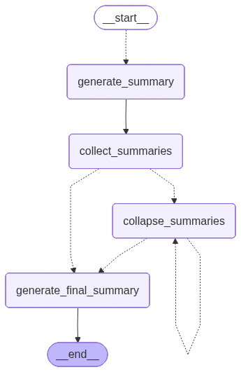

# 📄 LLM-Based Document Summarization with LangChain & LangGraph

This project explores how to summarize **large documents and multiple files using LLMs (Large Language Models)**.

We demonstrate efficient techniques for handling long texts, chunking strategies, and optimizing prompts to generate concise and meaningful summaries. This approach is ideal for researchers, content analysts, and anyone looking to extract key insights from vast amounts of text quickly.

---

## 🚀 Overview

Large Language Models have token limits, making long-document summarization challenging.

This project solves that using a structured pipeline:
- Split large documents into chunks  
- Generate summaries for each chunk  
- Collapse intermediate summaries when needed  
- Produce a final concise summary  

---

## 🧩 Workflow

---

## ⚙️ Tech Stack

- 🦜 LangChain  
- 🔗 LangGraph  
- 🤖 LLMs (OpenAI or compatible models)  
- 🐍 Python  

---

## 🧠 Key Concepts

## 🧠 Core Components Explained

This section explains the key functions and states used in the summarization pipeline built with **LangGraph**.

### 🔢 Token Limit Configuration

token_max = 2000

Defines the maximum token threshold allowed during summarization.

Since LLMs have context limits, this value is used to:

Control chunk sizes
Decide when summaries need to be collapsed further

### State Management

class OverAllState(TypedDict):
    contents: List[str]
    summaries: Annotated[List, operator.add()]
    collapsed_summaries: List[Document]
    final_summary: str

Represents the global state of the summarization workflow.

contents → List of input text chunks
summaries → Stores intermediate summaries (aggregated automatically using operator.add)
collapsed_summaries → Reduced summaries used for further processing
final_summary → Final output after full summarization

### SummaryState

class SummaryState(TypedDict):
    content: str

Represents the state for a single chunk during the map phase.

## Summary Generation (Map Phase)

async def generate_summary(state: SummaryState):

This function:

Takes a single text chunk (content)
Applies a prompt template (map_prompt)
Calls the LLM asynchronously
Returns a summary

👉 Purpose:
Generate parallel summaries for each chunk

## 🔁 Mapping Step

def map_summaries(state: OverAllState):

This function:

Iterates over all chunks (contents)
Sends each chunk to the generate_summary node

👉 Purpose:
Distribute work across multiple summarization tasks (map step)

## 📥 Collect Summaries

def collect_summaries(state: OverAllState):

This function:

Converts raw summaries into Document objects
Stores them in collapsed_summaries

👉 Purpose:
Prepare summaries for the reduce phase

## 🔽 Reduce Function
async def reduce_summary(input_dict: dict):

This function:

Combines multiple summaries into a single condensed summary
Uses a reduce_prompt for better aggregation

👉 Purpose:
Merge multiple summaries into fewer, more meaningful ones

## 📏 Token Length Function
def length_function(documents: List[Document]):

This function:

Calculates total token count across documents

👉 Purpose:
Ensure summaries stay within LLM token limits

## 🔄 Collapse Summaries (Recursive Reduction)
async def collapse_summaries(state: OverAllState):

This function:

Splits summaries into groups based on token limits
Applies reduce_summary on each group
Repeats until summaries fit within constraints

👉 Purpose:
Enable multi-level summarization for very large inputs

## 🔁 Full Flow Summary
Split document into chunks
Generate summaries (map phase)
Collect summaries
Collapse summaries if too large
Reduce into final summary

## 🎯 Key Design Principle

This pipeline follows a Map → Reduce → Collapse → Finalize pattern:

Map → Parallel chunk summarization
Reduce → Merge summaries
Collapse → Handle token overflow recursively
Finalize → Produce final output

## Clone the Repo

git clone <your-repo-url>
cd <your-repo>
pip install -r requirements.txt
export OPENAI_API_KEY=your_api_key
